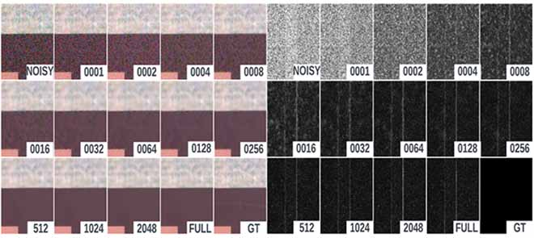

<p align="center">
  
</p>

<h1 align="center">Computationally Efficient NAS for Image Denoising</h1>

<p align="center">
  <a href="https://doi.org/10.1109/ACCESS.2025.3557691"></a>
  <a href="https://creativecommons.org/licenses/by/4.0/"></a>
  <a href="./LICENSE"></a>
  
  
</p>

<p align="center">
  <b>Esau A. Hervert Hernandez, Yan Cao, Nasser Kehtarnavaz</b><br>
  <i>IEEE Access</i>, vol. 13, pp. 60743–60762, 2025<br>
  <a href="https://doi.org/10.1109/ACCESS.2025.3557691">DOI: 10.1109/ACCESS.2025.3557691</a> ·
  <a href="https://ieeexplore.ieee.org/document/10948435">IEEE Xplore</a>
</p>

---

# Computationally Efficient NAS for Image Denoising

## TL;DR
We search for image-denoising architectures with an RL controller and weight sharing across a shared DHDN-based search space, and use Jensen–Shannon-divergence-guided dataset subsampling to cut search cost thus improving computational efficiency. The resulting architectures match or beat the DHDN baseline on SIDD (+0.28% SSIM / +0.66% PSNR on validation, +0.36% SSIM / +0.63% PSNR on benchmark) while training the controller and shared network in around 150 GPU-hours on NVIDIA Tesla V100 GPUs.

## Abstract
<details>
<summary>Abstract (from the published IEEE Access paper)</summary>

> In image denoising, deep neural networks require suitable architectural selection and noise-representative datasets for learning, often leading to significant computational demand. In this paper, this challenge is addressed in two ways. First, deep reinforcement learning is leveraged with weight-sharing for optimal architecture search, creating a shared model that enables efficient weight reuse across architectural configurations. This weight-sharing mechanism significantly reduces memory requirements. Second, by utilizing a representative subset of a dataset and examining empirical distributions of SSIM and PSNR values, it is demonstrated that comparable performance is achievable while reducing computational costs, provided that the subset is sufficiently sampled as measured by the Jensen-Shannon Divergence. This sufficiently sampled subset thus captures the characteristics of the full dataset. This combined approach of intelligent sampling and weight-shared reinforcement learning yields results equivalent to full-dataset training but with significantly reduced training time, demonstrating that efficient neural architecture search coupled with smart sampling can maintain high-quality denoising performance while substantially decreasing computational demand.

</details>

Builds on our prior conference paper:
> *"Deep Learning Architecture Search for Real-Time Image Denoising,"*
> Esau A. Hervert Hernandez, Yan Cao, Nasser Kehtarnavaz,
> Proc. SPIE 12102, Real-Time Image Processing and Deep Learning 2022, 1210205 (27 May 2022).
> https://doi.org/10.1117/12.2620349

<p align="center">
  <a href="https://doi.org/10.1117/12.2620349"></a>
</p>

## Method
The approach has three components:

| Component | What it does |
|---|---|
| **Search space** | A shared DHDN (Densely-connected Hierarchical Denoising Network) hypernetwork that encodes many candidate architectures via weight-sharing. |
| **Controller** | An LSTM-based RL controller that samples architectures from the search space; trained against an SSIM-based reward. |
| **Dataset subsampling** | Selecting training subsets that have sufficiently small Jensen–Shannon divergence to the full dataset; the resulting subset quality predicts downstream SSIM/PSNR (R² > 0.95). |

This builds on:
- **DHDN** — Park et al., CVPRW 2019
- **NAS with RL** — Zoph & Le, ICLR 2017
- **ENAS** — Pham et al., ICML 2018
- **SIDD** (dataset) — Abdelhamed et al., CVPR 2018
- **DIV2K** (dataset) — Agustsson & Timofte, CVPRW 2017

## Key results

| Setting | SSIM Change vs DHDN | PSNR Change vs DHDN |
|---|---|---|
| SIDD Validation | +0.28% | +0.66% |
| SIDD Benchmark | +0.36% | +0.63% |

**Optimal architecture (found by search):** 2×2 Conv stride-2 down-sampling, 5×5 DRC kernels, 2×2 Transpose-Conv stride-2 up-sampling.

**Model size:** ~4.63×10⁹ parameters, ~4.26 GB activation footprint at 16×3×64×64 batch (vs DHDN baseline ~1.61×10⁹ / ~3.14 GB).

**JS-div quality correlation:** R² > 0.95 on SIDD Benchmark and DIV2K (σ ∈ {0.01, 0.05, 0.10}).


## Repository structure

~~~
enas-networks/
├── ENAS-DHDN/                   # Hypernetwork + Controller code
├── DHDN-ENAS-Network-Search/    # NAS pipeline (TRAIN_SHARED, TRAIN_CONTROLLER, ENAS_DHDN_SEARCH)
├── utilities/                   # Data loaders + helper functions
├── Comparison/                  # Comparison runs (train_models.py & generate_denoised_image.py)
├── Benchmarks/                  # Baseline DHDN training, inference, ensemble, stat-sig notebooks
├── DHDN-Sensitivity-Analysis/   # JS-divergence sensitivity analysis
├── miscellaneous/               # One-off scripts
├── assets/                      # README figures (graphical abstract)
├── CITATION.cff                 # Machine-readable citation metadata
├── LICENSE                      # MIT, © 2022–2025 Esau A. Hervert Hernandez
├── README.md
└── requirements.txt
~~~

## Datasets

### SIDD (Smartphone Image Denoising Dataset)
- Real-world smartphone noisy/clean image pairs.
- Used for both training (SIDD Medium) and evaluation (SIDD Validation, SIDD Benchmark).
- Download: https://www.eecs.yorku.ca/~kamel/sidd/dataset.php

### DIV2K
- High-resolution (2K) clean images, with synthetic Gaussian noise added at σ ∈ {0.01, 0.05, 0.10}.
- Download: https://data.vision.ee.ethz.ch/cvl/DIV2K/

## Training

The NAS pipeline has three scripts across two stages, all implemented in `DHDN-ENAS-Network-Search/`:

1. **Shared network training** — `Train_Shared` script.
2. **Controller training** — `Train_Controller` script.
3. **End-to-end ENAS training** — `Train_ENAS` script (combines the above).

## Evaluation / Benchmarks

Quantitative evaluation scripts live in `Benchmarks/` (a mix of Python scripts, Jupyter notebooks, and MATLAB residual-image generation code). Sensitivity analyses (e.g., effect of dataset subsampling ratio on final SSIM/PSNR) live in `DHDN-Sensitivity-Analysis/`.

## Experiments — environment

- **Hardware:** NVIDIA Tesla V100 GPU.
- **Optimizer:** Adam, learning rate 5×10⁻⁵.
- **Schedulers:** shared net `StepLR(step=4, gamma=0.5)`; controller LSTM `StepLR(step=1, gamma=0.99)`.

## Installation

Tested with **Python 3.9** and **PyTorch 1.12 (torchvision 0.13.x)** on Linux with a CUDA-capable NVIDIA GPU. Training was validated on NVIDIA Tesla V100 GPUs.

~~~bash
# Clone
git clone https://github.com/EAHervert/enas-networks.git
cd enas-networks
conda create -n enas-denoise python=3.9 -y
conda activate enas-denoise
# Install Python dependencies
pip install -r requirements.txt
# Companion package used by some scripts
pip install git+https://github.com/EAHervert/research-tools.git
~~~

> **Note on OpenCV:** the previous `requirements.txt` listed `cv2`, which is not a valid PyPI package name. This revision installs OpenCV as `opencv-python`.

## Requirements
- PyTorch
- research-tools  https://github.com/EAHervert/research-tools
- [TODO] Complete dependency list

## Citation

If you use this code or the associated paper, please cite:

```bibtex
@article{hervert2025enas,
  author  = {Hervert Hernandez, Esau A. and Cao, Yan and Kehtarnavaz, Nasser},
  title   = {Computationally Efficient Neural Architecture Search for Image Denoising},
  journal = {IEEE Access},
  volume  = {13},
  pages   = {60743--60762},
  year    = {2025},
  doi     = {10.1109/ACCESS.2025.3557691}
}
```

## License

- **Paper text and figures:** CC BY 4.0.
- **Code in this repository:** MIT License — © 2022–2025 Esau A. Hervert Hernandez.

A machine-readable [`CITATION.cff`](./CITATION.cff) is also provided at the repo root.

## Contact
Esau A. Hervert Hernandez — esauhervert@utexas.edu

*The paper's IEEE record lists `eah170630@utdallas.edu` (UT Dallas); that account is no longer active.*
